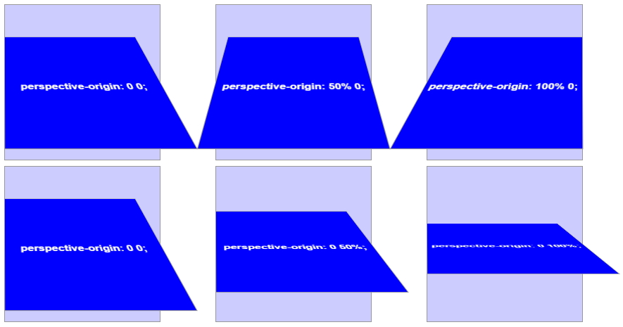

# css3 - perspective 속성


### perspective : length | none | initial | inherit


- 2D요소를 3D요소처럼 보여지게하는 원근법을 지정하는 속성,
3차원 픽셀을 얼마나 지정하는지 정의하는 속성

- ie10, FF에서 지원
(-webkit속성으로 크롬, 사파리, 오페라 지원 / ie9부터 하위브라우저 지원X)

- 0 => 1000px 이동할수록 밀집도가 증가, z축 (즉, 0일수록 3D효과 커짐)

- perspective()함수로 인해 transform속성 안에 지정 가능, perspective속성을 통해 부모 요소에 지정 가능

- 부모 요소에 지정할 경우, 자식요소들이 동일한 소실점(perspective-origin)을 갖음


```css
	.box {
		width:300px; margin:0 auto;
		-webkit-perspective:500px;
	}
	.box div {
		width:300px; height:300px; background:blue;
		transition:.5s;
	}
	.box div:hover {
		transform:rotateX(45deg);    
	}
```

```css
	.box div {
		width:300px; height:300px; background:blue;
		transform:perspective(500px) rotateX(45deg);
	}
```

### perspective-origin : x y | initial | inherit
- 소실점의 위치를 제어하여 관점의 각도를 명시

- 실제 전환이 될 요소보다는 부모 컨테이너에 적용

- default값 : 50%(center) 50%(center)

- x축 : left center right px %

- y축 : top center bottom px %


