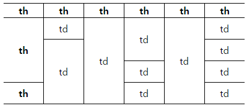

# rowspan에 대처가능한 테이블 만들기
### 설명
```
어떤 상황의 rowspan을 주어도 버텨내는 table입니다.  
```


### 대응
1. css3, JavaScript, jQuery를 사용하지 않습니다. ( IE8 )  
2. table의 border는 1px 입니다.  
3. table을 제외한 
4. 1px도 틀어지지 않는 완벽한 대응이 아닙니다. (유지보수 비용 절감을 위함)

### 소스
```html
<ul class="">
	<li>탭01</li>
	<li>탭02</li>
	<li>탭03</li>
	<li>탭04</li>
</ul>
```

### 힌트
힌트 없이 풀어보시고, 잘 되지 않을 때 힌트를 사용하세요~!

```
인접 형제 선택자(Adjacent Sibling Selector)  
```