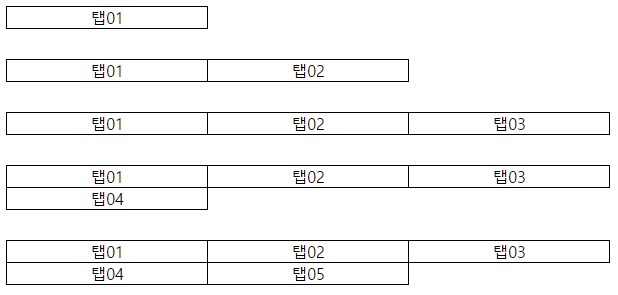

# 추가 삭제에 틀어지지 않는 탭

### 설명
```
고정폭의 탭이 늘어날 때마다 블럭이 쌓이는 탭  
프로젝트에서 많이 접하고 있고, 수정사항도 가끔 나오는 편입니다.  
```


### 대응
1. css3, JavaScript, jQuery를 사용하지 않습니다. ( IE8 )  
2. 탭의 border는 1px 입니다.  
3. li 태그에는 id, class등 어떤 속성도 추가하지 않습니다.  
4. 1px도 틀어지지 않는 완벽한 대응이 아닙니다. (유지보수 비용 절감을 위함)

### 소스
```html
<ul class="">
	<li>탭01</li>
	<li>탭02</li>
	<li>탭03</li>
	<li>탭04</li>
</ul>
```
